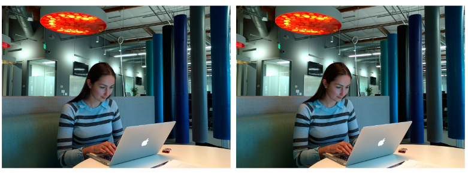
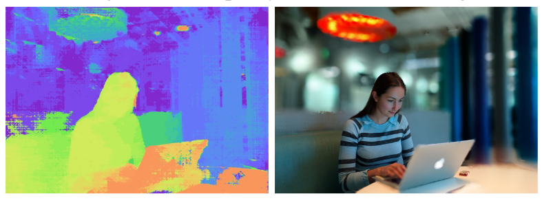

# PIX- IT Project Proposal

1. Project ID - 13   Project Title - Fast Bilateral-Space Stereo for Synthetic Defocus
2. Github link - https://github.com/Digital-Image-Processing-IIITH/project-pix-it
3. Team Members
  - Apoorva Thirupathi (2019121012)
  - Balavarun Pedapudi (2020101012)
  - Jhanvi Shingala (2020701008)
  - Mohd Omama (2020701006)
4. Main Goals - Create a depth map from stereo pair and use that depth to render a synthetically defocused image. Implementing the [paper](http://people.csail.mit.edu/yichangshih/bilateral_stereo/BarronCVPR2015.pdf).

5. Synthetical defocussing without hardware. Converting stereo images to bilateral space and solve depth as an optimization problem. This depth map can be used to render a defocussing effect on the image.   The project will be developed using python, opencv.

6. Result of the project would be to create a synthetically defocussed image from the stereo image pair. This algorithm should be efficient enough to be used without much latency.
  - The input to the algorithm is a stereo pair
  
  - The output is a defocused image using depth map
  

7. Milestones for the project and tentative deadlines for the same are:  
  - Creating simplified bilateral grid (24 Oct)
  - Stereo matching (28 Oct)
  - Loss function formulation (31 Oct) 
  - Bilateral solver (optimization in bilateral space) (7 Nov)
  - Obtaining the defocussing image from the stereo images using the depth map.(10 Nov)
  - Optimizing and testing the implementation.(18 Nov)

8. The stereo images for the implementation can be obtained from:
  - [Stereo Dataset by University of Bologna, Italy ](https://vision.deis.unibo.it/fede/ds-stereo-lab.html) 
  - [Open source implementation of the paper](https://github.com/tvandenzegel/fast_bilateral_space_stereo)
